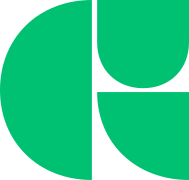

## About Me
Hello! I'm Edward (@rotenaple), an aspiring IT professional currently pursuing a Bachelor of Information Technology. My passion lies at the intersection of coding and design, where I explore the endless possibilities of digital innovation.

With a keen interest in UI/UX design and typography, I am committed to crafting intuitive and aesthetically pleasing digital experiences. My experience extends beyond theoretical knowledge, as I actively engage in projects that demonstrate the transformative impact of technology in enhancing user interaction and interface efficiency.

## Languages & Software
|||||||
|:-------------:|:-----------:|:-----------:|:-----------------:|:-------------:|:-------------:|
||  |  |  |  |  |
| HTML | CSS | C++ | Python | Dart | Flutter |
||  |  |  |  |
| Java | MongoDB | Unreal Engine | Affinity Designer | Glyphs |
